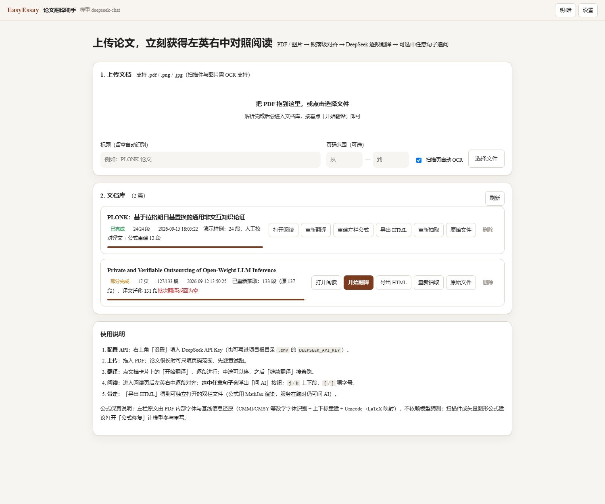
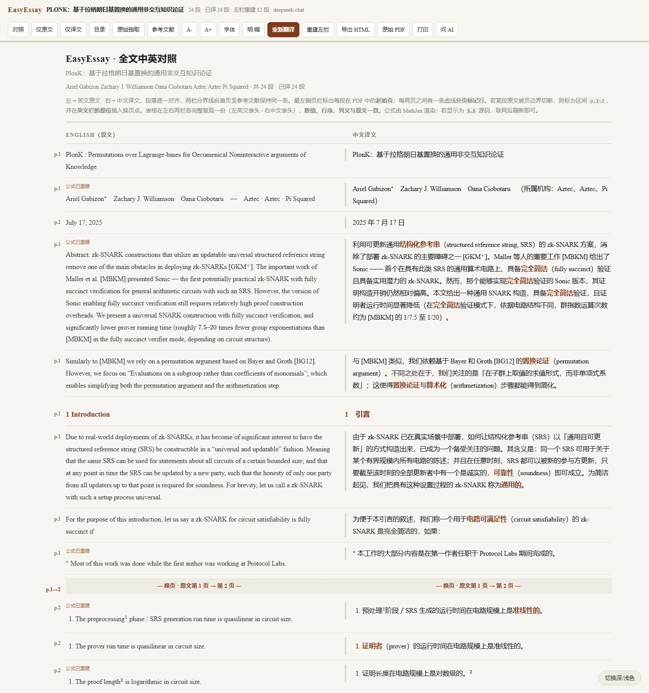

# EasyEssay · 论文翻译助手

上传 PDF → 自动抽取段落与公式 → 用**你自己的 DeepSeek API Key** 逐段翻译 →
得到一个**左边英文原文、右边中文译文**的对照阅读界面，可以选中任意句子直接追问 AI。

**不需要注册，不需要登录**：填一次自己的 API Key 就能用，密钥只保存在本机。

## 看效果

上面是应用界面（拖入 PDF、文档库、一键翻译），下面是对照阅读页
（左英右中逐段对齐、最左侧是原文页码栏、公式由 MathJax 真渲染）。





不想装任何东西也想看成品？直接打开
[`samples/demo-plonk/PLONK-论文前两页-中英对照示例.html`](samples/demo-plonk/)
（离线文件，双击即可，公式由本地 MathJax 渲染）。

## 它解决什么

读英文论文时最费劲的两件事：**公式看不懂**、**长难句要来回查**。EasyEssay 的做法是：

- **逐段对齐**：原文与译文严格一段对一段（靠段落 id 在机制上保证，不靠模型自觉），
  任何时候都能左右对照，不会串行。
- **公式真渲染**：公式用 LaTeX 表达、由 MathJax 渲染，绝不出现 Unicode 伪公式（`P⃗`）
  或裸露的 `\alpha` 源码。公式还原是**确定性的**：靠 PDF 内部字体信息 + 基线偏移重建
  上下标 + Unicode→LaTeX 映射，不依赖模型猜测（详见下文「公式保真」）。
- **选中即问**：在任意一侧选中句子，浮出「问 AI」，可问解释、公式推导、术语含义，
  译文不准还能让它重译。回答同样用 LaTeX 渲染。
- **可带走**：一键导出**自包含的 HTML**，断网也能读（MathJax 有本地副本），
  服务在跑时导出的文件里依然可以继续问 AI。

## 下载即用（推荐）

不想碰命令行：到 [Releases](../../releases) 下载对应平台的压缩包，解压后**双击** `EasyEssay`
（Windows 是 `EasyEssay.exe`）——会弹出一个**应用窗口**（不是浏览器标签页），第一次让你填
自己的 DeepSeek API Key，填一次就记住了。**不需要注册、不需要登录。**

想用浏览器打开、或窗口起不来时：

```bash
EasyEssay.exe --browser     # 改用浏览器打开
EasyEssay.exe --no-browser  # 只启动服务，自己访问提示的地址
```

| 平台 | 文件 |
|---|---|
| Windows 10/11 | `EasyEssay-windows-x86_64.zip` |
| macOS（Apple 芯片） | `EasyEssay-macos-arm64.zip` |
| Linux x86_64 | `EasyEssay-linux-x86_64.zip` |

数据都存在程序旁边的 `data/` 目录里（含译文与设置），删掉它就等于恢复出厂；换电脑时整个目录拷走即可。

## 从源码运行

```bash
git clone <本仓库> && cd EasyEssay
python -m venv .venv
.venv/Scripts/python -m pip install -r requirements.txt     # Windows
# .venv/bin/python -m pip install -r requirements.txt       # macOS / Linux

python easyessay.py            # 会弹出应用窗口（装了 pywebview）
python easyessay.py --browser  # 强制用浏览器打开
python easyessay.py --port 9000 --no-browser
python easyessay.py --open     # 让同一局域网的别人也能访问（无密码，只在可信网络用）
```

API Key 三种给法（任选其一）：

1. 打开页面后填（存在本机 `data/settings.json`）；
2. 环境变量 `DEEPSEEK_API_KEY=sk-...`；
3. 项目根目录 `.env`（复制 `.env.example`）。

接口是 OpenAI 兼容的，所以也能换成硅基流动、OpenAI、本地 Ollama 等（改 Base URL 即可）。

## 排版标准：对齐「论文中英对照」成品

导出的阅读页不是普通的双栏网页，而是按论文精读成品的排版做的：

| 特征 | 说明 |
|---|---|
| 衬线排版 | 正文用 Times New Roman + 中文衬线回退；顶栏「字体」可切无衬线 |
| 左侧页码栏 | 每段标出在 PDF 中的起始页（`p.5`）；跨页段标区间（`p.1–2`） |
| 分页标记行 | 每两页之间一条虚线标记行（`p.4→5`），两栏在该行保持连续 |
| 段内换页点 | 被页边界切断的段落在**英文栏原位**插入「— 换页 · 原文第 1 页 → 第 2 页 —」 |
| 真表格 | 用 PyMuPDF 表格识别抽出，左右两栏各完整复现一份，数值/行序/列义与原文一致 |
| 公式框 | 独立公式放进浅底框居中，行内公式随文排版 |
| 分级标题 | 论文标题/一级标题（`head`）、二级标题（`sub`）、图表题注（`caption`）、参考文献（`tiny`） |
| 术语高亮 | 译文中关键术语用主题色标注，悬停显示英文原词 |
| 页尾 | `— End of paper — / — 全文完 —` |
| 深浅色 | 右下角浮动按钮切换 |

导出后双击即可阅读；顶栏的「原始抽取」可切到 PDF 直抽版本对照。

## 打包发布 / 自己构建可执行文件

```bash
pip install -r requirements-build.txt        # 只需 PyInstaller
python packaging/build.py --zip              # 产出 dist/EasyEssay(.exe) 与 zip
python packaging/build.py --onedir --console # 目录版 + 保留控制台（排错用）
python packaging/make_icon.py                # 重新生成应用图标（用代码画的，无需素材）
```

打包要点（脚本里都有注释）：`web/` 会打进包内，`data/` 落在可执行文件旁边（不会随退出丢失），
uvicorn 的隐藏导入已处理，Windows 下双击失败会弹窗给出原因而不是一闪而过。

仓库自带 GitHub Actions：**打 tag 就自动为三个平台构建并把 zip 挂到 Release**。

```bash
git tag v1.0.0 && git push origin v1.0.0
```

工作流里会先跑接口层自测与翻译流水线自测，通过才打包（见 `.github/workflows/release.yml`）。

## 命令行用法（不开浏览器）

```bash
# 转前 10 页到 out/paper.html（文档会留在文档库里，可在网页继续读）
python -m app.cli paper.pdf --pages 1-10 -o out/

# 只抽取、不翻译：先看版面与公式还原效果
python -m app.cli paper.pdf --pages 1-3 --no-translate

# 译文已经有了、只想把左栏公式修好（花费远低于重译）
python -m app.cli paper.pdf --restore-only

# 自定义提示词 / 模型 / 批次
python -m app.cli paper.pdf --model deepseek-chat --batch 6 \
    --system-prompt "翻译成中文，术语首次出现标注英文原词"

# 离线自测（不需要 API Key，产出〔模拟译文〕占位文本）
python -m app.cli paper.pdf --mock --temp -o out/mock.html
```

## 自测

四套自测，**都不需要 API Key**（翻译用的是内置的模拟提供方）：

```bash
python scripts/http_test.py       # 40 项：接口层（上传→抽取→翻译→导出→问答，含 404/错误码）
python scripts/pipeline_test.py   # 30 项：翻译流水线（分批/术语表/补漏/断点续译/幂等）
EE_JSDOM=<jsdom 路径> node scripts/render_test.js <导出.html>   # 导出页无头渲染（双栏/页码栏/公式）
EE_JSDOM=<jsdom 路径> node scripts/ui_smoke.js                  # 首页「填 Key 即用」流程
```

`http_test.py` 与 `pipeline_test.py` 在 CI 里每次发布前都会跑。


README 里的截图也是脚本产出的（可复现）：

```bash
python scripts/make_screenshots.py      # 用 headless Chrome 截首页/阅读页/离线样例
```

## 项目结构

```
EasyEssay/
├── easyessay.py            启动入口（打包也用它）
├── app/                    后端（Python / FastAPI）
│   ├── main.py             HTTP 接口：上传、翻译、问答(SSE)、导出
│   ├── cli.py              命令行：PDF → 对照 HTML、生成静态阅读库
│   ├── extract.py          PDF → 段落：双栏检测、页眉页脚过滤、跨页续段、表格识别
│   ├── mathify.py          ★ 公式还原：数学字体识别、上下标重建、Unicode→LaTeX
│   ├── ocr.py              扫描件 / 图片 OCR（可选）
│   ├── deepseek.py         OpenAI 兼容客户端：重试、JSON 模式、流式
│   ├── translate.py        逐段翻译流水线（分批、术语表、失败二分重试）+ 问答
│   ├── mock.py             离线自测用的模拟提供方（provider=mock）
│   ├── render.py           导出「可独立打开」的双栏 HTML
│   ├── site.py             生成静态「论文阅读库」站点
│   ├── maintain.py         重新抽取并按内容锚点保住已有译文
│   ├── store.py            文档落盘：data/docs/<id>/{meta,extracted,translated}.json
│   └── config.py           路径与默认提示词（兼容打包后的运行方式）
├── web/                    前端（原生 HTML/CSS/JS，无构建步骤）
│   ├── index.html          上传与文档库      ├── reader.html  对照阅读页
│   ├── css/reader.css      阅读器样式（应用内与导出文件共用）
│   ├── js/bilingual.js     ★ 双栏对照渲染、术语高亮、选中即问
│   ├── js/askpanel.js      「问 AI」侧栏（SSE 流式）
│   └── vendor/mathjax/     本地 MathJax（离线可渲染公式）
├── packaging/build.py      打包成可执行文件（PyInstaller）
├── .github/workflows/      打 tag 自动构建并发布 Release
├── scripts/                http_test / pipeline_test / render_test / make_demo / deploy_pages
├── samples/                示例论文与离线样例
├── attic/                  已停用的功能（账号体系）留档
└── data/                   运行时数据（文档、译文、设置）
```

## 使用流程

1. **上传**：拖入 PDF。论文很长时先填页码范围（例如 1–10）试跑，确认效果再全量。
2. **翻译**：点「开始翻译」。逐批进行，每批完成即落盘，**可以随时停止、之后接着翻**
   （只补未翻译的段落）；「重新翻译」才会覆盖已有译文。
3. **阅读**：左英右中；顶栏可切换「对照 / 仅原文 / 仅译文」「参考文献」「A-/A+」「明暗」。
   快捷键：`j`/`k` 上下段、`[`/`]` 调字号、`t` 开目录、`Esc` 关浮标。
4. **追问**：选中句子 → 浮出「问 AI / 解释公式 / 译得更准」，右侧抽屉流式作答。
5. **带走**：「导出 HTML」得到自包含文件；「原始 PDF」可另开窗口与原版并排看。

## 公式保真：两步法（这是本项目最关键的设计）

PDF 里**只存字形坐标，不存数学语义**：`\vec P`、`\mathrm{Decode}`、`\langle \cdot,\cdot\rangle`、
分式横线、上下标位置，在文本层全是散的。所以任何"纯抽取"都不可能还原出可渲染的公式——
这正是纯抽取方案在公式密集的密码学论文上表现很差的原因。

EasyEssay 的做法是**两步并存**，而不是二选一：

| 阶段 | 产物 | 说明 |
|---|---|---|
| ① 确定性抽取 | `原始抽取` | 靠 PDF 字体名（`CMMI/CMSY/CMEX/MSAM/MSBM/EUFM` 是数学字体，`CMR/CMBX/CMTI` 是正文字体）+ 基线偏移重建上下标 + Unicode→LaTeX 映射，**不经过模型**。用于兜底与核对。 |
| ② 模型重建 | `重建原文`（默认显示） | 把①的结果交回模型，要求它**只规范化数学排版、不改文字**：该写 `\frac{}{}`、`\sum_{i=1}^{n}`、`\vec{}`、`\langle \rangle` 的要完整写出。与翻译在**同一次请求**里返回，不额外花钱。 |

顶栏的 **「原始抽取」** 按钮可在两版之间随时切换，所以"左栏可不可信"这件事是可以当场核对的，
而不是只能听模型说。设置里的 **「左栏原文重建」** 可整体关掉（例如你只想看 PDF 直抽结果）。

**已经翻过译的文档想单独修左栏？** 用顶栏的 **「重建左栏」**（或 `--restore-only`、`POST /api/docs/{id}/restore`）：
它只让模型返回重建后的原文、不重译，输出短、花费远低于重新翻译，且**已有译文一字不动**。
该任务幂等：跑过一次的段落（含"无需改动"的）不会重复处理。

**遇到 PDF 字体表坏了怎么办**：有些 PDF 的 ToUnicode 表是错的 —— 实测某论文里
LaTeX 的大括号字体 `CMEX10` 被映射成控制字符 `U+0010/U+0011` 与私有区码位 `U+F8EE…`，
而它们其实是**矩阵的方括号、跨行大括号的上/下半截**。早期实现会「静默丢弃」这些字形，
公式就少了括号，模型拿到残缺输入自然翻错。所以现在改为**显式占位 + 三层还原**
（详见本节末尾「认不出的字形（⟦?⟧）怎么处理」）。

**改动示例（PLONK 论文真实抽取结果）**：

```
① PDF 直抽： $L _{x}$($X ) = c^{x}$($X^{n}-$ 1) ($X - x$ )$,$
② 模型重建： $$L_x(X) = c_x \cdot \frac{X^{n} - 1}{X - x}$$
```

分式横线、`\cdot`、上下标位置在 PDF 文本层根本不存在——这就是为什么必须由模型按数学含义重建。

抽取阶段的具体步骤（阶段①）：

| 步骤 | 做法 |
|---|---|
| 1. 判定数学片段 | PDF 字体名 + Unicode 数学区段兜底 |
| 2. 行级校准 | 单字母是否为变量，取决于同一行有没有真正含数学符号的片段——既还原 `y = f(x)`，又不会把标题 `PlonK` 拆成 `$P$$lon$$K$` |
| 3. 上下标重建 | 字号差异 + 基线偏移（`origin.y`）+ 与前一字符的紧邻性，输出 `x^{2}`、`G_{1}` |
| 4. 字符→LaTeX | 内置 300+ 映射（希腊字母、关系符、大运算符、箭头、黑板体/花体…），其余走 `pylatexenc` |
| 5. 认不出的字形 | 换成显式占位符 `⟦?⟧`（**绝不静默丢弃**），并记下"这段有几处要修" |

### 认不出的字形（⟦?⟧）怎么处理

有些 PDF 的字体表（ToUnicode）是坏的，大括号、求和号、大 ⊕ 这类来自扩展字体
（CMEX10）的字形，抽出来是控制字符（`\x10`）、私有区码位（`\uf8ee`），甚至直接消失。
本项目的做法是**三层还原**，越靠前越可靠：

| 顺序 | 做法 | 说明 |
|---|---|---|
| ① 查字体字形名 | 读字体自己的 `/Encoding` 数组，`parenleftBig`→`\big(`、`summationtext`→`\sum`、`circleplusdisplay`→`\bigoplus` | **能查出来的绝不让模型猜**。读的是字体，不是 OCR |
| ② 模型按上下文还原 | 剩下真正无法确定的交给模型，并把前后段落一起给它当上下文 | 整段只剩 ⟦?⟧ 的碎片会被**并回上一条公式**（它本来就是同一条公式被切成两半） |
| ③ 校验 + 严格重试 | 查"伪装修复"：照抄占位符 / 换成 `?` / 换成空括号 / 换成空矩阵单元格 | 查不出结果的段落如实标记，不假装修好了 |

大括号被拆成的**拼接片段**（`bracketlefttp/bt/ex`）故意不做①：一个大 `[` 拆成三块，
逐块映射会输出 `[[[`，比占位符更糟。这类交给②。

界面上 ⟦?⟧ 不会裸着显示成乱码，而是一个带说明的小标记；阅读页顶栏还有
**「修复公式段（N）」** 按钮，只重译有问题的段落，不用全文重跑。

**边界（如实说明）**：

- 扫描版 PDF / 公式被转成矢量图形：PDF 里没有可读字体信息，阶段①只能靠 OCR，阶段②的重建质量也随之下降。
- 个别 PDF 的数学排版丢失了基线信息（例如某些 ePrint 修订版），阶段①的上下标可能判错——此时完全依赖阶段②。
- 阶段②是**模型改写**，存在极小概率的过度修正。要严格核对时切到「原始抽取」看阶段①的结果。
- 复杂表格会被按阅读顺序铺平（PDF 本身没有表格语义），建议对照原始 PDF 看表格。

## API 接口一览

| 方法 | 路径 | 说明 |
|---|---|---|
| POST | `/api/upload` | 上传 PDF/图片；`title`、`page_from`、`page_to`、`use_ocr` |
| GET | `/api/docs` | 文档库列表 |
| GET | `/api/docs/{id}` | 段落 + 译文 + 进度 |
| POST | `/api/docs/{id}/translate` | 开始翻译（`force=false` 只补缺失段落） |
| POST | `/api/docs/{id}/stop` | 停止翻译 |
| POST | `/api/docs/{id}/retranslate` | 按自定义要求重译某一段 |
| POST | `/api/docs/{id}/ask` | 提问，SSE 流式返回 |
| POST | `/api/docs/{id}/reextract` | 用最新抽取器重新抽取（保留译文） |
| GET | `/api/docs/{id}/export` | 导出离线双栏 HTML |
| GET | `/api/docs/{id}/source` | 原始文件 |
| GET/POST | `/api/settings` | 读写设置（Key、模型、提示词…） |
| POST | `/api/settings/test` | 测试 Key / Base URL / 模型连通性 |

## 参考的开源项目

本项目为**自研实现**（未直接 fork 代码），但界面与交互有意借鉴了同类优秀开源项目的做法：

- [`PDFMathTranslate/PDFMathTranslate`](https://github.com/PDFMathTranslate/PDFMathTranslate)
  （EMNLP 2025 Demo）与 [`pdf2zh-next` / BabelDOC](https://pdf2zh-next.com/zh/)：
  科学 PDF 双语对照、公式保留与版面处理的工业级实践，是本项目「双栏对照 + 公式必须保留」
  这一设计目标的主要参照。
- [`immersive-translate/immersive-translate`](https://github.com/immersive-translate/immersive-translate)：
  双语对照阅读时的悬停联动、段落级对齐交互。
- [`openai-translator/openai-translator`](https://github.com/openai-translator/openai-translator)：
  划词选中 → 浮标 → 追问的交互形态。
- [`binary-husky/gpt_academic`](https://github.com/binary-husky/gpt_academic)：
  论文问答与 LaTeX 渲染的产品化细节。

若你更希望直接基于上述某个项目做二次开发（例如接入它的 PDF 版面还原能力，
或把它作为前端外壳），告诉我目标仓库，我可以据此调整现有代码结构。

## 排错

- **点翻译没反应 / 提示未配置 Key**：右上角「设置」填 Key 后点「测试连接」。
- **公式显示成源码**：多半是 MathJax 没加载（内网/断网）。项目自带
  `web/vendor/mathjax/tex-svg.js`，会自动回退到本地副本；导出的 HTML 请与
  `vendor/` 目录一起移动。
- **扫描页没内容**：安装 `pip install -r requirements-ocr.txt` 后重新上传并勾选 OCR。
- **端口占用**：`python -m app.main --port 8899`。
- 更细的说明见 [`docs/USAGE.md`](docs/USAGE.md)。

## 许可与数据

论文 PDF 仅在你的机器上处理；API Key 只保存在本地 `data/settings.json`（不会上传到第三方）。
`samples/` 中的论文来自 IACR ePrint 公开论文，仅用于功能演示，版权归原作者所有。
